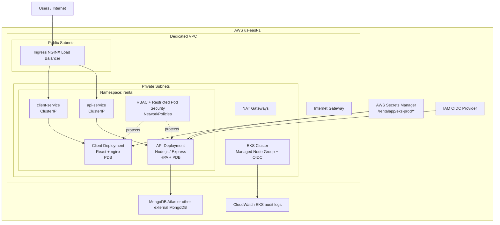

# RentalApp EKS Infrastructure

This repository contains the AWS infrastructure and Kubernetes manifests for running RentalApp on Amazon EKS. It is the EKS-focused cloud stack for the platform, with Terraform provisioning the AWS foundation and Kustomize defining the workloads that run on the cluster.

## Architecture



## What This Stack Includes

- A dedicated VPC with public and private subnets across multiple AZs.
- An EKS control plane with a managed node group.
- EKS add-ons for `vpc-cni`, `coredns`, and `kube-proxy`.
- An IAM OIDC provider for IRSA-ready add-ons and future AWS integrations.
- AWS Secrets Manager for application secrets.
- Kubernetes base manifests for the API and frontend workloads.
- Production overlays for EKS and a separate Minikube overlay for local testing.
- Deployment helpers for EKS and Minikube.

## Repository Layout

- [terraform/environments/eks-production](terraform/environments/eks-production) contains the EKS environment wrapper.
- [terraform/modules/networking](terraform/modules/networking) creates the VPC, subnets, IGW, NAT gateways, and routing.
- [terraform/modules/eks-cluster](terraform/modules/eks-cluster) provisions the EKS cluster, node group, add-ons, and OIDC provider.
- [terraform/modules/app-secrets](terraform/modules/app-secrets) stores app secrets in AWS Secrets Manager.
- [k8s/base](k8s/base) contains reusable Kubernetes resources.
- [k8s/overlays/eks-production](k8s/overlays/eks-production) contains the EKS production overlay.
- [k8s/overlays/minikube](k8s/overlays/minikube) contains the local development overlay.
- [k8s/run-eks.sh](k8s/run-eks.sh) installs cluster add-ons and applies the EKS manifests.
- [k8s/run-minikube.sh](k8s/run-minikube.sh) bootstraps a local cluster for testing.

## AWS Infrastructure

Terraform is the source of truth for the cloud foundation. The EKS environment in [terraform/environments/eks-production/main.tf](terraform/environments/eks-production/main.tf) wires together:

1. The VPC and subnets from [terraform/modules/networking/main.tf](terraform/modules/networking/main.tf).
2. The EKS cluster and managed node group from [terraform/modules/eks-cluster/main.tf](terraform/modules/eks-cluster/main.tf).
3. Secrets stored in AWS Secrets Manager from [terraform/modules/app-secrets/main.tf](terraform/modules/app-secrets/main.tf).

Important defaults and guardrails:

- The cluster version defaults to Kubernetes 1.30.
- Worker nodes run in private subnets.
- The EKS API endpoint is intended to be CIDR-restricted.
- State is stored in S3 with DynamoDB locking.

## Kubernetes Runtime

The runtime layer is managed with Kustomize.

- [k8s/base/namespace.yaml](k8s/base/namespace.yaml) enforces restricted Pod Security Admission.
- [k8s/base/rbac.yaml](k8s/base/rbac.yaml) creates tokenless service accounts and least-privilege RBAC.
- [k8s/base/api-deployment.yaml](k8s/base/api-deployment.yaml) defines the Node.js API with security hardening, probes, and resource limits.
- [k8s/base/client-deployment.yaml](k8s/base/client-deployment.yaml) defines the React/nginx frontend workload.
- [k8s/base/network-policies.yaml](k8s/base/network-policies.yaml) implements default-deny networking with explicit allows.
- [k8s/base/api-hpa.yaml](k8s/base/api-hpa.yaml) auto-scales the API.
- [k8s/base/api-pdb.yaml](k8s/base/api-pdb.yaml) and [k8s/base/client-pdb.yaml](k8s/base/client-pdb.yaml) protect availability during disruptions.

## Secrets Flow

The EKS deployment hydrates runtime secrets from AWS Secrets Manager at deploy time.

1. Secrets are stored under the `/rentalapp/eks-prod` prefix.
2. [k8s/run-eks.sh](k8s/run-eks.sh) reads them with the AWS CLI.
3. The script writes `k8s/overlays/eks-production/secrets.env`.
4. Kustomize turns that file into a Kubernetes Secret.
5. The API and frontend consume the secret through environment variables.

## Deployment

### Provision AWS resources

```bash
cd terraform/environments/eks-production
terraform init
terraform plan -out=tfplan
terraform apply tfplan
```

### Configure kubectl

```bash
aws eks update-kubeconfig --region us-east-1 --name rentalapp-eks-prod-eks
```

### Deploy the platform

```bash
./k8s/run-eks.sh
```

The helper installs `ingress-nginx`, `cert-manager`, and `metrics-server`, then applies the EKS overlay and waits for the API and client rollouts to finish.

## Security Model

- Namespace-level Pod Security Admission uses the `restricted` profile.
- Service account tokens are disabled for the app workloads.
- The API and client pods run as non-root users with read-only root filesystems.
- NetworkPolicy uses default-deny plus explicit ingress and egress paths.
- The EKS control plane logs are enabled for audit and troubleshooting.

## Operations And Verification

- Use [k8s/verification-runbook.md](k8s/verification-runbook.md) for smoke tests and policy checks.
- Use [terraform/environments/eks-production/README.md](terraform/environments/eks-production/README.md) for the environment provisioning flow.
- Use [k8s/README.md](k8s/README.md) for overlay behavior and local vs production deployment details.

## Local Testing

The Minikube overlay exists for safe local validation.

```bash
./k8s/run-minikube.sh
```

That path builds local images, enables the ingress and metrics addons, and applies the Minikube overlay with a single-node MongoDB for development.

## Notes

- This repository is EKS-first, but some older ECS-era files still exist in the tree during migration.
- Keep Terraform state, generated secret files, and local environment files out of Git.
- If you use a custom domain, point it at the ingress controller endpoint after AWS provisions the load balancer.
